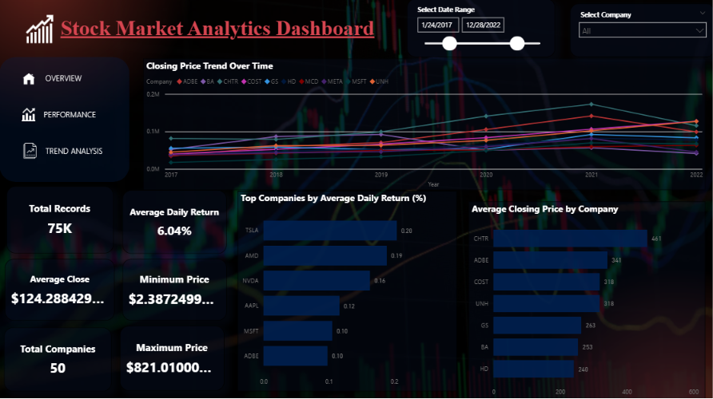
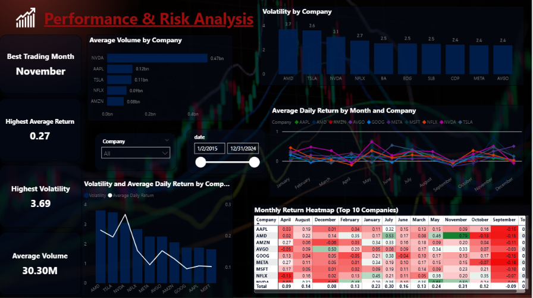
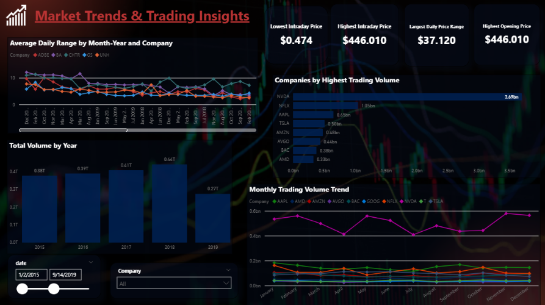

# 📈 Stock Market Analytics Pipeline

## Overview

The **Stock Market Analytics Pipeline** is an end-to-end data analytics project that automates the process of collecting, transforming, storing, analyzing, and visualizing historical stock market data.

Historical stock data is extracted from the **Yahoo Finance API**, cleaned and transformed using **Python (Pandas)**, stored in **PostgreSQL**, analyzed with **Advanced SQL**, and visualized through **interactive Power BI dashboards**.

The project demonstrates a complete ETL (Extract, Transform, Load) workflow and provides business insights into stock performance, market trends, volatility, trading activity, and investment analysis.

---

# Project Architecture

```text
                 Yahoo Finance API
                        │
                        ▼
             Python (Data Extraction)
                        │
                        ▼
          Data Cleaning & Transformation
                 (Pandas & NumPy)
                        │
                        ▼
            Feature Engineering
    (Returns, MA, Volatility, etc.)
                        │
                        ▼
                 PostgreSQL Database
                        │
                        ▼
              Advanced SQL Analysis
                        │
                        ▼
              Power BI Dashboards
                        │
                        ▼
               Business Insights
```

---

# Tech Stack

| Category | Technologies |
|----------|--------------|
| Programming | Python |
| Data Processing | Pandas, NumPy |
| Data Source | Yahoo Finance API (yfinance) |
| Database | PostgreSQL |
| ORM | SQLAlchemy |
| SQL | PostgreSQL SQL, CTEs, Window Functions |
| Visualization | Power BI |
| Version Control | Git & GitHub |

---

# Project Workflow

## Step 1 – Data Extraction

- Connected to Yahoo Finance API
- Downloaded historical stock market data
- Extracted data for multiple companies
- Stored raw CSV files

---

## Step 2 – Data Transformation

Performed data cleaning including:

- Removing duplicate records
- Handling missing values
- Data type conversion
- Sorting records
- Data validation

---

## Step 3 – Feature Engineering

Created business metrics including:

- Price Change
- Daily Return (%)
- Moving Average (10 Days)
- Moving Average (30 Days)
- Daily Price Range
- 10-Day Average Trading Volume
- 30-Day Volatility
- Cumulative Return

---

## Step 4 – Database Loading

- Connected Python with PostgreSQL using SQLAlchemy
- Loaded transformed dataset
- Created centralized analytical database

---

## Step 5 – SQL Analysis

Performed advanced SQL analysis using:

- Aggregate Functions
- GROUP BY
- ORDER BY
- Window Functions
- CTEs
- Ranking Functions
- Data Quality Checks
- Risk Analysis

---

## Step 6 – Power BI Dashboard

Developed three interactive dashboards to monitor stock performance and trading behavior.

---

# Key Features

✔ End-to-End ETL Pipeline

✔ Automated Historical Data Collection

✔ PostgreSQL Database Integration

✔ Advanced SQL Analysis

✔ Business Metric Generation

✔ Interactive Power BI Dashboards

✔ Risk & Volatility Analysis

✔ Trading Volume Analysis

✔ Stock Performance Comparison

---

# SQL Analysis

The project contains professional SQL scripts organized into separate modules.

| SQL File | Description |
|----------|-------------|
| basic_queries.sql | Basic data exploration |
| business_queries.sql | Business KPI analysis |
| window_functions.sql | Running totals, rankings, moving analysis |
| cte_queries.sql | Advanced SQL using CTEs |
| risk_analysis.sql | Volatility and risk analysis |
| correlation_data_quality.sql | Correlation analysis and data validation |

---

# Power BI Dashboards

## Dashboard 1 – Executive Overview



---

## Dashboard 2 – Performance & Risk Analysis



---

## Dashboard 3 – Market Trends & Trading Insights


# Business Insights

Some key insights generated from the analysis include:

- Identified the highest-performing stocks based on cumulative returns.
- Compared stock volatility across multiple companies.
- Analyzed daily return patterns and price fluctuations.
- Monitored long-term stock price movements.
- Evaluated trading volume trends and market activity.
- Measured company-wise average closing prices.
- Examined historical market behavior using time-series analysis.

---

# Folder Structure

```text
Stock-Market-Analytics-Pipeline/
│
├── data/
│   ├── raw/
│   └── processed/
│
├── dashboard/
│   ├── Stock_Market_Dashboard.pbix
│   └── dashboard_screenshots/
│       ├── dashboard1.png
│       ├── dashboard2.png
│       └── dashboard3.png
│
├── database/
│
├── notebooks/
│
├── reports/
│
├── sql/
│   ├── basic_queries.sql
│   ├── business_queries.sql
│   ├── window_functions.sql
│   ├── cte_queries.sql
│   ├── risk_analysis.sql
│   └── correlation_data_quality.sql
│
├── src/
│   ├── config.py
│   ├── extract.py
│   ├── transform.py
│   ├── load.py
│   └── main.py
│
├── requirements.txt
├── README.md
└── .gitignore
```

---

# How to Run the Project

### 1. Clone the repository

```bash
git clone https://github.com/your-username/Stock-Market-Analytics-Pipeline.git
```

### 2. Navigate to the project

```bash
cd Stock-Market-Analytics-Pipeline
```

### 3. Create a virtual environment

```bash
python -m venv venv
```

### 4. Activate the virtual environment

Windows

```bash
venv\Scripts\activate
```

Linux/macOS

```bash
source venv/bin/activate
```

### 5. Install dependencies

```bash
pip install -r requirements.txt
```

### 6. Configure PostgreSQL

Update the database credentials in `config.py`.

### 7. Execute the ETL pipeline

```bash
python src/extract.py
python src/transform.py
python src/load.py
```

### 8. Run SQL scripts

Execute the SQL files in PostgreSQL using pgAdmin or psql.

### 9. Open the Power BI dashboard

Open:

```
dashboard/Stock_Market_Dashboard.pbix
```

Refresh the data source and explore the dashboards.

---

# Future Improvements

- Real-time stock data streaming
- Automated ETL scheduling using Apache Airflow
- Machine Learning for stock price forecasting
- REST API for dashboard integration
- Cloud deployment using AWS

---

# Author

**Ashvini Bhagat**


